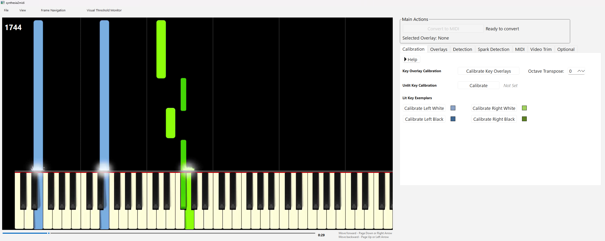

# Synthesia2MIDI

Turn Synthesia videos into MIDI.

Synthesia2MIDI is a desktop app for piano learners who want to turn Synthesia-style videos into editable MIDI files.

This project is **not affiliated with Synthesia**.

[](https://github.com/thepharmd1992/synthesia2midi/releases/latest/download/Synthesia2MIDI-macos-arm64-latest.zip)
[](https://github.com/thepharmd1992/synthesia2midi/releases/latest/download/Synthesia2MIDI-windows-x64-latest.zip)
[](https://github.com/thepharmd1992/synthesia2midi/releases)



## Download

- **macOS (Apple Silicon):** download the macOS button above, unzip the app, and open it
- **Windows (x64):** download the Windows button above, unzip it, and launch `Synthesia2MIDI.exe`

If your computer blocks the app the first time:

- **macOS:** open **System Settings > Privacy & Security** and choose **Open Anyway**
- **Windows:** click **More info**, then **Run anyway**

## What It Can Do

### Download YouTube piano videos directly

Paste a YouTube link and pull the video into the app without juggling separate downloader tools.

### Convert video to MIDI

Load a Synthesia-style piano video, line things up, and export a MIDI file you can keep working with.

### Clean up the result in the touch-up editor

Open the built-in touch-up editor to fix notes, timing, and cleanup after conversion.

## How It Works

1. Download or open a piano video
2. Load it into Synthesia2MIDI
3. Convert the video into MIDI
4. Clean up the result if needed
5. Export your finished MIDI file

## Who It's For

Synthesia2MIDI is built for people learning songs from Synthesia-style piano videos who want a MIDI they can study, edit, or reuse.

## For Developers

If you want to work on the source code instead of just using the app:

- Setup and verification: [docs/testing.md](docs/testing.md)
- Documentation index: [docs/README.md](docs/README.md)
- Project/license details stay in this repository

Quick start:

```bash
python3 setup_env.py
python3 run.py
```

On Windows, use:

```powershell
py setup_env.py
py run.py
```

Acknowledgments: see [ACKNOWLEDGMENTS.md](ACKNOWLEDGMENTS.md).

## Third-Party Licenses

See `THIRD_PARTY_NOTICES.md` for a list of third-party dependencies, included tools, and assets.

## License

This repository is licensed under GPL-3.0-only. See `LICENSE`.
